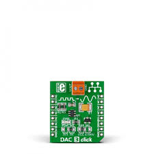

# Hematocrit Detection

<p align="center">

</p>
<p align="center">
</p>

## Overview
This project aimed at applying Snell's Law for Hematocrit Detection. Specifically, hematocrit is defined as the region between red blood cells and plasma in a centrifuged vial of blood. Determining the location of the hematocrit can be analyzed and translated to an appropriate indication of health. This projects aims to do this using an infrared laser and a spectrometer.

## Concept and Application - Snell's Law
The overall idea involves the following pipeline:
1. Shine a laser through a centrifuged vial of blood
2. The laser will refract through different mediums in different ways. 
3. Record the refraction of the laser through different regions of the vial using the spectrometer
4. Analyze refraction data as distinguishing a difference in refraction means we've found the hematocrit

## Hardware Setup
The hardware was setup primarily of the following components
- Raspberry Pi
- Physical Housing 
- 5V Laser
- Digital-to-Analog Converter (DAC)
- Stepper Motor
- Spectrometer

### 5V Laser
Used to shine a light through the vial of blood being analyzed. By observing and recording the behavior of the laser through the vial of blood we can determine where the location of the hematocrit

<p align="center">

</p>
<p align="center">
5V Infrared Laser
</p>

### Stepper Motor
Using the stepper motor we can move the laser to scan for the hematocrit through the vial.
<p align="center">

</p>
<p align="center">
Stepper Motor and Circuit Board
</p>

### Spectrometer
Can read light reflections from the laser through the vial and onto the spectrometer.

### Digital-to-Analog Converter (DAC)
Different regions of the blood require different laser strengths. Thus, the DAC will properly self-regulate the required laser strength needed to get an appropriate light reading. 

<p align="center">

</p>
<p align="center">
Digital-to-Analog Converter
</p>

### Raspberry Pi
Functioned as our primary logic unit. Housed relevant python software that controlled any given component.

### Physical Housing
Constructed using 80/20 Aluminum Extrusions where different hardware components could be mounted on to create a fully functioning system

## Software Design

### Overview

The software is a Python-based GUI application that controls a spectrometer, stepper motor, and DAC to detect hematocrit regions through a centrifuged blood sample. It utilizes real-time spectral plotting, motor control, and Gaussian curve fitting to collect and interpret data.

### Features

- **Real-time spectral data acquisition** via Ocean Optics spectrometer
- **Live plotting** of spectral data using `matplotlib`
- **Stepper motor control** through a custom `Motor` class
- **Laser power adjustment** via I2C DAC
- **Gaussian fitting** of peaks to track laser refraction location
- **Absorbance mode toggle** for light intensity normalization
- **User interface** built with `tkinter` for interactive parameter tuning
- **Automated data logging** with timestamped folder output

### Software Flow

1. **Initialization**:
   - Configure spectrometer integration time and wavelength range.
   - Initialize motor and set laser intensity via DAC.
   - Set up GUI window and plotting area.

2. **Real-Time Operation**:

    - **2.1. Periodic Spectral Data Capture**  
    The spectrometer collects intensity data at each scan position. Each reading is triggered as the system iterates.

        ``` python
        data_messy = spec.intensities(correct_dark_counts=True, correct_nonlinearity=False)
        ```

    - **2.2. Dynamic Laser Intensity Adjustment**  
The laser's intensity is controlled using the DAC. To maintain consistent signal quality, the intensity is adjusted based on the peak of the previously captured spectrum.

        ```python
        if self.peak[1] > 4000:
            new_intensity = self.intensity - 40
        elif self.peak[1] < 3000:
            new_intensity = self.intensity + 40
        else:
            new_intensity = self.intensity
        self.intensity = new_intensity
        setOutput(self.intensity)   
        ```

    - **2.3. Stepper Motor Scanning**  
After capturing a set number of data at a position, the stepper motor advances by a small amount to scan the next vertical position along the vial.

        ```python
        if self.count % 5 == 0:
            self.state = self.motor.moveUp(1000)
            print('moved: ', self.motor.Distance)
        ```
    - **2.4. Spectrum Processing**  
        Each spectrum collected is:
        - Smoothed
        - Fitted with a Gaussian to identify the spectral peak more accurately.

        ``` python
        self.data = clean_data(data_messy)
        self.peak = self.get_peak()

        #creates x range and intensity data that exclude low intensity values

        #fit gaussian
        try:
            new_center, new_fitted_data = self.get_gaussian_peak()
            self.center, self.fitted_data = new_center, new_fitted_data
        except:
            #new_center, new_fitted_data = None, np.zeros(2048)
            self.center = -9999
            print('fail')
            self.fitted_data = np.zeros(2048)
        ```

    - **2.5 Tracking and Logging Spectral Peaks**  
The center of each fitted Gaussian is logged as the detected peak wavelength. These peak shifts over position are used to determine transitions in refractive index

        ``` python
        self.centers.append(self.center)
        self.positions.append(self.motor.Distance)
        self.data_compiled.append(self.data)
        ```

3. **Data Logging**:  
At the end of a scan, `centers.csv` (Gaussian peak centers) and `data.csv` (spectral data at each step) are saved to a timestamped directory for future data analysis

    ```python
        def write_to_csv(self, centers_file, data_file):
            # generate dataframe
            
            transposed = [[row[i] for row in self.data_compiled] for i in range(len(self.data_compiled[0]))]
            
            c_df = pd.DataFrame([self.centers], columns=[f'Position {self.positions[i]}' for i in range(len(self.centers))])
            data_df = pd.DataFrame(transposed, columns=[f'Step {i+1}' for i in range(len(self.data_compiled))]) 

            folder_path = create_timestamped_folder()

            # write dataframe to the csv
            c_df.to_csv(os.path.join(folder_path, centers_file), index=False)
            data_df.to_csv(os.path.join(folder_path, data_file),index=False)
    ```

